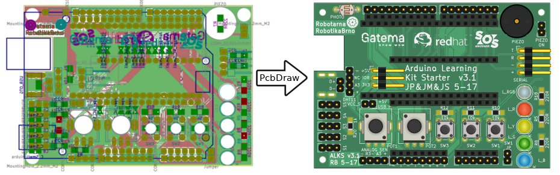
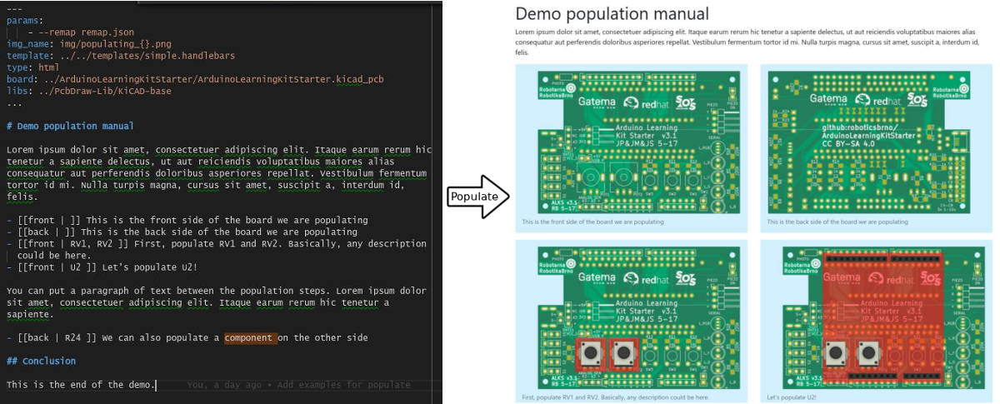

# PcbDraw

Convert your KiCAD boards into nice looking 2D drawings suitable for pinout
diagrams. Never draw them manually again!

This tool takes a KiCAD board (.kicad_pcb file) and produces a 2D
nice looking drawing of the board as an SVG file. This allows you to quickly and
automatically create awesome pinout diagrams for your project. These diagrams
are much easier to read than a labeled photo of a physical board or an actual
KiCAD design.

You and your users will love them!

PcbDraw also comes with a small utility called Populate which allows you to
easily specify & maintain nice looking HTML or Markdown population manuals.

And, also, as a bonus it allows you to programmatically obtain 3D-rendered
previews of your boards (e.g., in CI).

## Installation

PcbDraw is a stand-alone CLI tool distributed as a Python package `pcbdraw`. It
also requires Inkscape 1 or librsvg installed. Read more details in the
[installation guide](doc/installation.md).

## Usage

There are two separate guides:

- [usage of PcbDraw](doc/pcbdraw.md)
- [usage of Populate](doc/populate.md)
- [library management tools](doc/library.md)

There are also examples of usage in the `examples` directory.

## PcbDraw seems to be broken!

Please, read [FAQ](doc/faq.md) first. If it does not answer your problem, feel
free to open issue on GitHub.

## Contributing

Feel free to submit issues and pull requests!

## Future Work

- make reasonably complete module library
